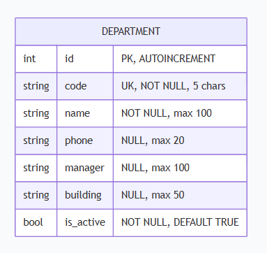

# Вариант №5
# Сервис управления отделениями/факультетами СПО (Department Service)

## Сущность: Department (Отделение/Факультет)

### 1. Информация для создания сущности

| Параметр | Обязательность | Тип | Ограничение | Значение по умолчанию |
|----------|----------------|-----|-------------|-----------------------|
| `name` | Да | str | длина ≤ 100 | — |
| `code` | Да | str | ровно 5 символов, уникально | — |
| `phone` | Нет | str | длина ≤ 20 | `None` |
| `manager` | Нет | str | длина ≤ 100 | `None` |
| `building` | Нет | str | длина ≤ 50 | `None` |
| `is_active` | Нет | bool | True/False | `True` |

**Уникальные комбинации параметров:**
- `code` (уникальный код отделения)

**Обоснование параметров:**
- `code` — 5 символов (например, "ИТ-21", "ЭКО-1", "ПРОМ")
- `manager` — заведующий отделением/декан факультета
- `building` — корпус или адрес размещения отделения
- `is_active` — активность отделения (можно скрыть недействующие)

---

### 2. Информация, возвращаемая при успешном создании

| Параметр | Тип |
|----------|-----|
| `id` | int |
| `name` | str |
| `code` | str |
| `phone` | str или `None` |
| `manager` | str или `None` |
| `building` | str или `None` |
| `is_active` | bool |

---

## Изменить сущность по ID

### 3. Информация для изменения сущности

| Параметр | Обязательность | Тип | Ограничение | Значение по умолчанию |
|----------|----------------|-----|-------------|-----------------------|
| `name` | Нет | str | длина ≤ 100 | текущее значение |
| `phone` | Нет | str | длина ≤ 20 | текущее значение |
| `manager` | Нет | str | длина ≤ 100 | текущее значение |
| `building` | Нет | str | длина ≤ 50 | текущее значение |
| `is_active` | Нет | bool | True/False | текущее значение |

> **Примечание:** Поле `code` изменять нельзя.

### 4. Информация, возвращаемая при успешном изменении

| Параметр | Тип |
|----------|-----|
| `id` | int |
| `name` | str |
| `code` | str |
| `phone` | str или `None` |
| `manager` | str или `None` |
| `building` | str или `None` |
| `is_active` | bool |

---

## Удалить сущность по ID

**Возвращаемое значение:**
- `True` — если отделение было успешно удалено
- `False` — если отделение с указанным ID не найдено

---

## Получить сущность по ID

### 5. Информация, возвращаемая при успешном поиске

| Параметр | Тип |
|----------|-----|
| `id` | int |
| `name` | str |
| `code` | str |
| `phone` | str или `None` |
| `manager` | str или `None` |
| `building` | str или `None` |
| `is_active` | bool |

---

## Получить список сущностей по заданным параметрам

### 6. Параметры для получения списка

| Параметр | Тип | Описание |
|----------|-----|-----------|
| `name` | str | Поиск по части названия отделения |
| `code` | str | Точное совпадение кода отделения |
| `manager` | str | Поиск по ФИО заведующего |
| `building` | str | Поиск по корпусу/зданию |
| `is_active` | bool | Фильтр по активности |
| `limit` | int | Максимум записей (по умолчанию 100) |
| `offset` | int | Пагинация (по умолчанию 0) |

### 7. Возвращаемый список сущностей

| Параметр | Тип |
|----------|-----|
| `id` | int |
| `name` | str |
| `code` | str |
| `phone` | str или `None` |
| `manager` | str или `None` |
| `building` | str или `None` |
| `is_active` | bool |

---

## ER-диаграмма

